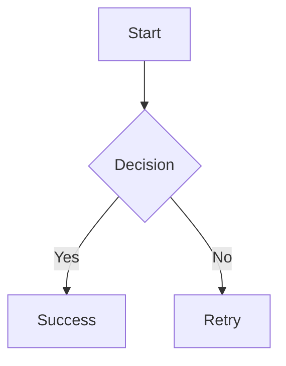

# 📘 Markdown Full Power Showcase

This document demonstrates **almost every practical Markdown trick** supported by modern renderers  
(GitHub, VS Code, MkDocs, Docusaurus).

---

## 1. Headings

# H1
## H2
### H3
#### H4
##### H5
###### H6

---

## 2. Text Formatting

- *Italic*
- **Bold**
- ***Bold + Italic***
- ~~Strikethrough~~
- `Inline code`

Escaping:
\*not italic\*  
\# not heading

---

## 3. Lists

### Unordered
- Item
  - Sub item
    - Sub-sub item

### Ordered
1. First
2. Second
   1. Nested

### Task List (GFM)
- [x] Done
- [ ] Todo

---

## 4. Links & Images

[OpenAI](https://openai.com)

Reference link [here][ref].

[ref]: https://example.com

Image:


---

## 5. Code Blocks

Inline: `git status`

```c
#include <stdio.h>
int main() {
  printf("Hello Markdown!\n");
  return 0;
}
```

```bash
git clone repo
cd repo
make all
```

---

## 6. Tables

| Name | Score | Pass |
|:-----|:-----:|-----:|
| Luc  |  95   | ✅ |
| Bob  |  60   | ❌ |

---

## 7. Blockquotes

> This is a quote
>> Nested quote
>>> Very deep

> **Tip:** Quotes can contain *formatting*.

---

## 8. Horizontal Rules

---
***
___

---

## 9. Emojis (GFM)

:rocket: :warning: :white_check_mark: :fire:

---

## 10. HTML Inside Markdown

<details>
<summary>Click to expand</summary>

This content is hidden by default.

- Works on GitHub
- Works in VS Code preview

</details>

---

## 11. Footnotes (Renderer-dependent)

Markdown is powerful[^note].

[^note]: This is a footnote.

---

## 12. Diagrams (Mermaid)



---

## 13. Math (LaTeX-style)

Inline math: $E = mc^2$

Block math:

$$
\int_0^\infty e^{-x} dx = 1
$$

---

## 14. Comments (Hidden)

<!-- This will not appear in rendered output -->

---

## 15. Anchors & TOC

- [Headings](#1-headings)
- [Code Blocks](#5-code-blocks)
- [Tables](#6-tables)

---

## 16. What Markdown Cannot Do ❌

| Feature | Supported |
|------|------|
| Buttons | ❌ |
| JavaScript | ❌ |
| Forms | ❌ |
| Dynamic Logic | ❌ |

---

## 17. Best Practices

- Keep lines under 80–100 chars
- Use reference links for large docs
- Prefer fenced code blocks
- Let renderers add UI (copy buttons)

---

## 18. Philosophy

> Markdown is **structured plain text**, not a UI language.

---

## ✅ End of Showcase

You can now:
- Open this file in VS Code
- Upload to GitHub
- Convert to PDF / HTML
- Use as a Markdown reference

Happy writing 🚀
